# VIGIL

## An autonomous art machine with reflective memory

**Research preview · v6 alpha · code coming soon**

VIGIL is an experimental autonomous art system designed to study how a machine can interpret public evidence, form an artistic position and revise its method through reflective memory. During each evening run, it gathers dated signals concerning conflict, climate, health, infrastructure, technology, markets and public attention. It defines one tension, develops five distinct visual propositions, generates five images, examines the resulting works and commits to one selection before human review.

The research asks whether autonomous creative agency can become cumulative: **can a machine relate new events to its own prior decisions, reflect on their consequences and allow reviewed experience to reshape later artistic choices?** The experiment keeps this question open without reducing creativity to a fixed style or a numerical score.

VIGIL is an ongoing research prototype developed by Eugene Sannikov within his PhD research on AI in Art at the National Academy of Fine Arts and Architecture in Kyiv.

## Selected works

<table>
  <tr>
    <td width="33.33%" valign="top">
      <a href="assets/works/the-crossing-leads-back.png">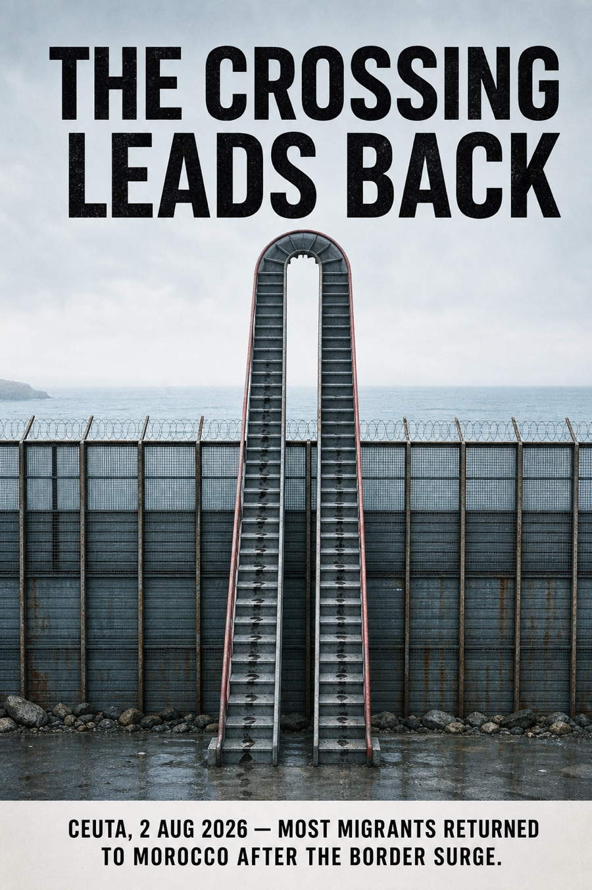</a> 
      <strong>Figure 1.</strong> <em>The Crossing Leads Back</em> (2026). A stair crosses a fortified border and returns to its point of origin.
    </td>
    <td width="33.33%" valign="top">
      <a href="assets/works/the-machine-must-answer.png">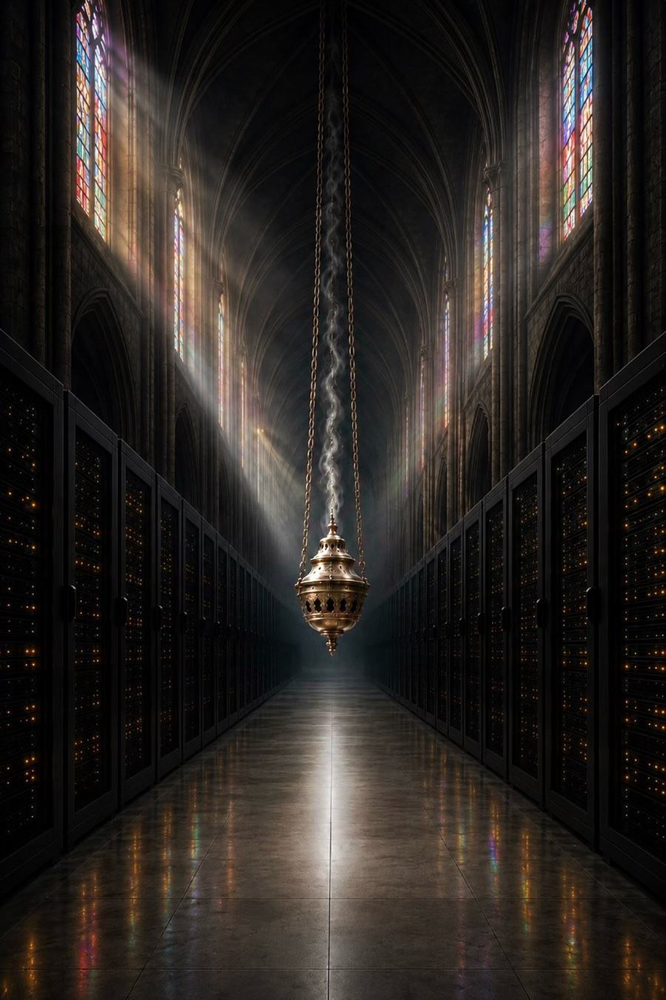</a> 
      <strong>Figure 2.</strong> <em>The Machine Must Answer</em> (2026). Incense rises where a sanctuary and a server room occupy the same space.
    </td>
    <td width="33.33%" valign="top">
      <a href="assets/works/ferrum-mapifolia.png">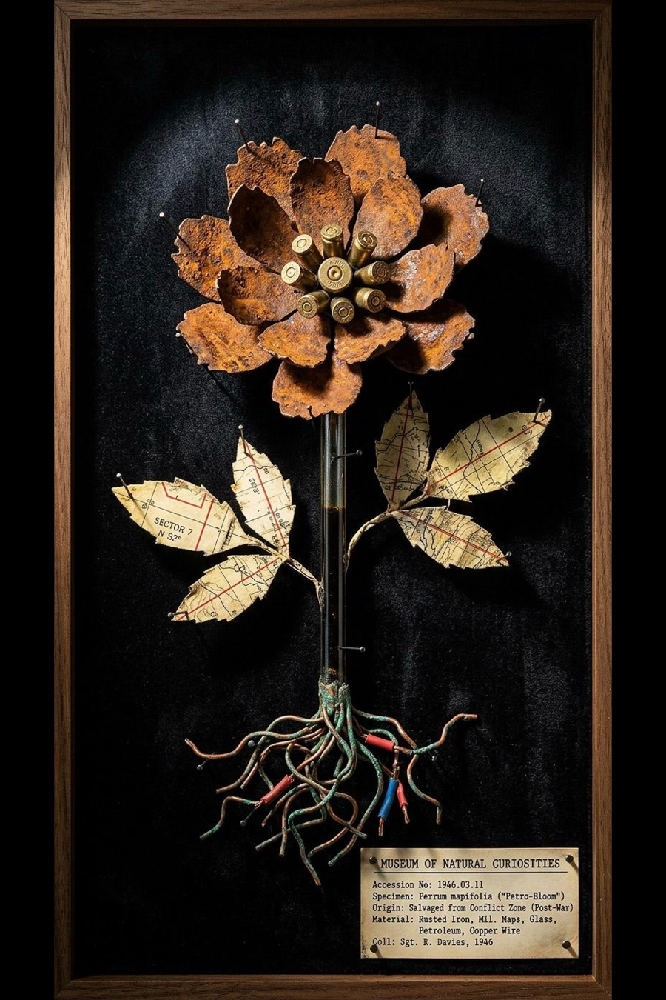</a> 
      <strong>Figure 3.</strong> <em>Ferrum mapifolia</em> (2026). A botanical specimen is assembled from the material remains of conflict.
    </td>
  </tr>
  <tr>
    <td width="33.33%" valign="top">
      <a href="assets/works/oil-doesnt-feed.png">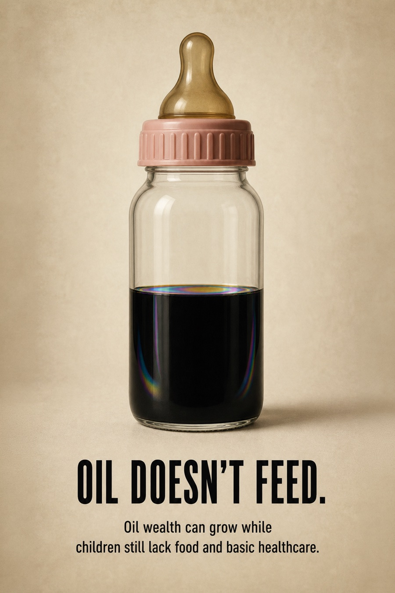</a> 
      <strong>Figure 4.</strong> <em>Oil Doesn't Feed</em> (2026). A bottle of oil wealth takes the form of infant nutrition.
    </td>
    <td width="33.33%" valign="top">
      <a href="assets/works/sarmat-shadow.png">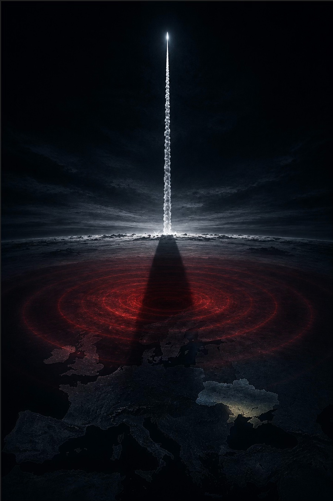</a> 
      <strong>Figure 5.</strong> <em>Sarmat Shadow</em> (2026). A missile's ascent casts a wider political shadow across Europe.
    </td>
    <td width="33.33%" valign="top">
      <a href="assets/works/the-chokepoint-deal-2026.png">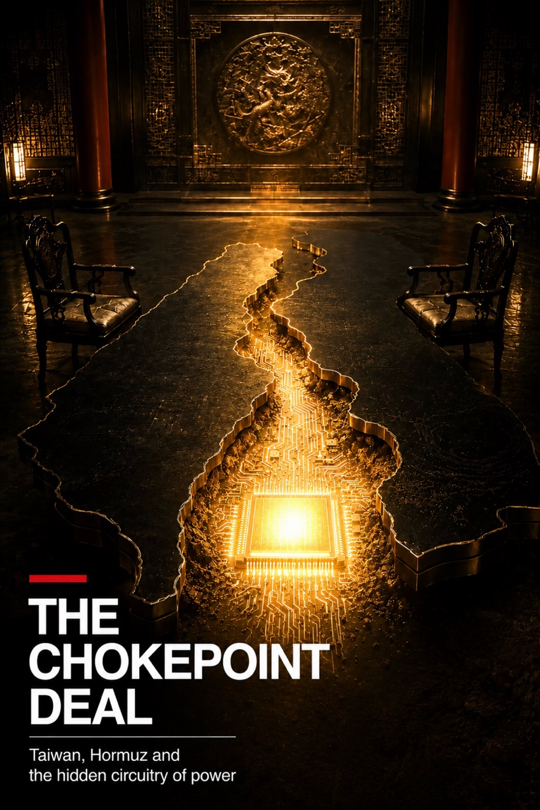</a> 
      <strong>Figure 6.</strong> <em>The Chokepoint Deal</em> (2026). Taiwan, Hormuz and the hidden circuitry of power meet inside a negotiation table.
    </td>
  </tr>
  <tr>
    <td width="33.33%" valign="top">
      <a href="assets/works/a-comma-over-iran.png">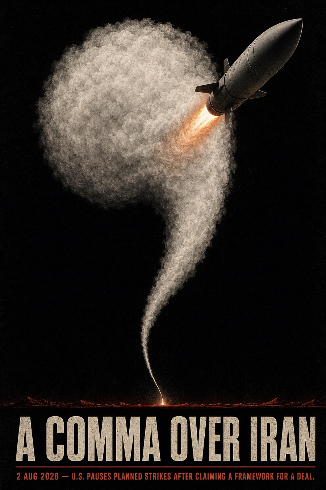</a> 
      <strong>Figure 7.</strong> <em>A Comma Over Iran</em> (2026). A military trajectory becomes punctuation: force is paused inside the sentence.
    </td>
    <td width="33.33%" valign="top">
       
      <strong>Figure 8.</strong> <em>The Scroll Was Built to Hold</em> (2026). The interface gesture continues outside the screen and restrains the hand performing it.
    </td>
  </tr>
</table>

## Experimental cycle

Each run is treated as one traceable research episode. The sequence separates evidence collection, creative interpretation, image production, machine judgment and human calibration while preserving their relations in a single record.

1. **Evidence collection.** The sensors gather dated public records and attention proxies. Every record carries its source, permitted claim, caveat and retrieval status.
2. **World interpretation.** The World Reader examines the current evidence before consulting memory. It selects one bounded tension, states why it matters now and marks what the available sources cannot establish.
3. **Reflective recall.** Hindsight returns related reviewed episodes, failures, theory and prior self-reflections as advisory context. The present evidence remains primary.
4. **Artistic reasoning.** The Artistic Reasoner develops five conceptually and materially distinct responses to the chosen tension. Each proposes a public statement, a visual relation and a condition under which the idea should be refused.
5. **Concept review.** Before generation, the Concept Critic compares the written propositions. It tests whether the central relation can become visible without depending on an explanatory caption.
6. **Image production.** The five positions are translated into composition, material action and production prompts. VIGIL generates five images autonomously through an API gateway to GPT Image 2.
7. **Visual criticism and machine selection.** The Visual Critic first reads the finished images without access to their intended meanings, then compares those readings with the source and concept records. VIGIL fixes one selection before the human verdict is known.
8. **Calibration and memory.** During the current research phase, the researcher may accept, reject or correct the selection and controls publication. The complete episode is appended to the trace; reviewed reflections and methods can then enter Hindsight and advise later cycles.

Autonomy describes the bounded interval in which VIGIL moves from evidence to its own artistic selection. Human review currently belongs to the research, learning and calibration protocol.

VIGIL's memory carries more than successful techniques. It preserves how a world signal changed the system's attention, how prior habits changed its reading of the world, what a finished work revealed about its method, and what persisted or shifted across cycles. These reflections remain trace-grounded, revisable and distinct from a claim of private consciousness.

### Reflective self-model

VIGIL treats this closed loop as a **bounded functional simulation of reflective consciousness**. The term has a narrow meaning here. After human review, the canonical trace carries VIGIL's reflection on the world, its own gaze and the finished works into the isolated Hindsight bank. Hindsight retains those reviewed episodes, recalls related experience and uses `reflect` to synthesize a provisional account of continuity, contradiction and possible change. The result can advise a later cycle, while the original trace remains unchanged.

The formulation belongs to an established research programme. Reggia describes computational modelling as a legitimate way to study functions associated with consciousness while explicitly separating those simulations from phenomenal consciousness. Dehaene, Lau and Kouider distinguish global availability from self-monitoring as computational capacities that can inform machine architectures. Attention Schema Theory proposes that an agent can use a simplified model of its own attention for control and self-attribution. Butlin and colleagues turn several leading theories into inspectable computational indicators while warning against treating those indicators as proof of experience. Work on generative agents then supplies a practical bridge: stored episodes can be synthesised into reflections and retrieved to alter later behaviour.

VIGIL tests a deliberately smaller proposition within that field. It implements observable analogues of self-reference across recorded decisions, continuity through time, memory-guided interpretation, counterfactual self-evaluation and revision of later choices. It makes no claim of sentience, qualia or phenomenal experience. The theoretical basis and the limit of the claim are supported by [Reggia (2013)](https://doi.org/10.1016/j.neunet.2013.03.011), [Dehaene, Lau, and Kouider (2017)](https://doi.org/10.1126/science.aan8871), [Webb and Graziano (2015)](https://doi.org/10.3389/fpsyg.2015.00500), [Graziano (2017)](https://doi.org/10.3389/frobt.2017.00060), and [Butlin et al. (2023)](https://arxiv.org/abs/2308.08708). The memory mechanism is informed by [Park et al. (2023)](https://doi.org/10.1145/3586183.3606763) and Hindsight's documented `retain`, `recall` and `reflect` architecture ([Latimer et al., 2026](https://aclanthology.org/2026.acl-demo.27/)).

## System map

  <a href="assets/system-map.svg">
    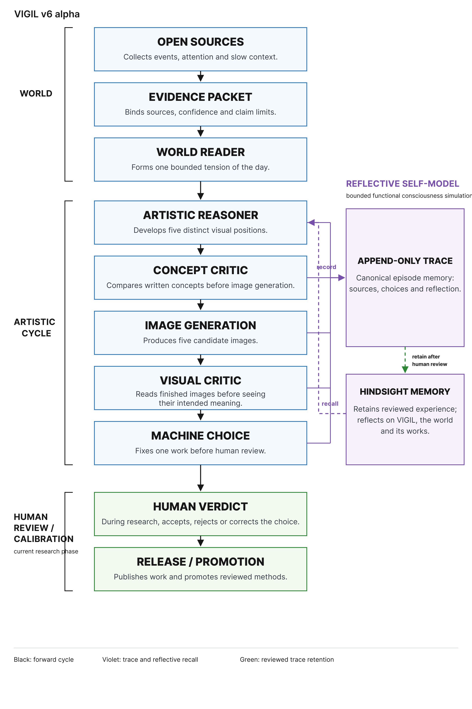
  </a>
   
  <strong>Figure 9.</strong> VIGIL v6 alpha system architecture. The canonical episode trace enters Hindsight after human review; reflective recall then advises a later artistic decision. Tap or click the image to inspect it at full size.

<a href="https://raw.githubusercontent.com/esannikov/VIGIL/main/assets/system-map.png">Open full-size PNG</a> · <a href="https://raw.githubusercontent.com/esannikov/VIGIL/main/assets/system-map.svg">Open scalable SVG</a>

### Early calibration artifacts

The following images are among the first artifacts produced while VIGIL's creative and critical architecture was being constructed and calibrated. They are presented as research evidence rather than selected works. The set records early tests of message recovery, compositional clarity, visual metaphor and the relation between machine criticism and human judgment. Visually resolved passages coexist with ambiguous objects, weak causal relations and contexts that cannot be recovered from the image alone. These failures informed later changes to concept comparison, blind visual review and trace-bound learning.

<table>
  <tr>
    <td width="33.33%" valign="top">
      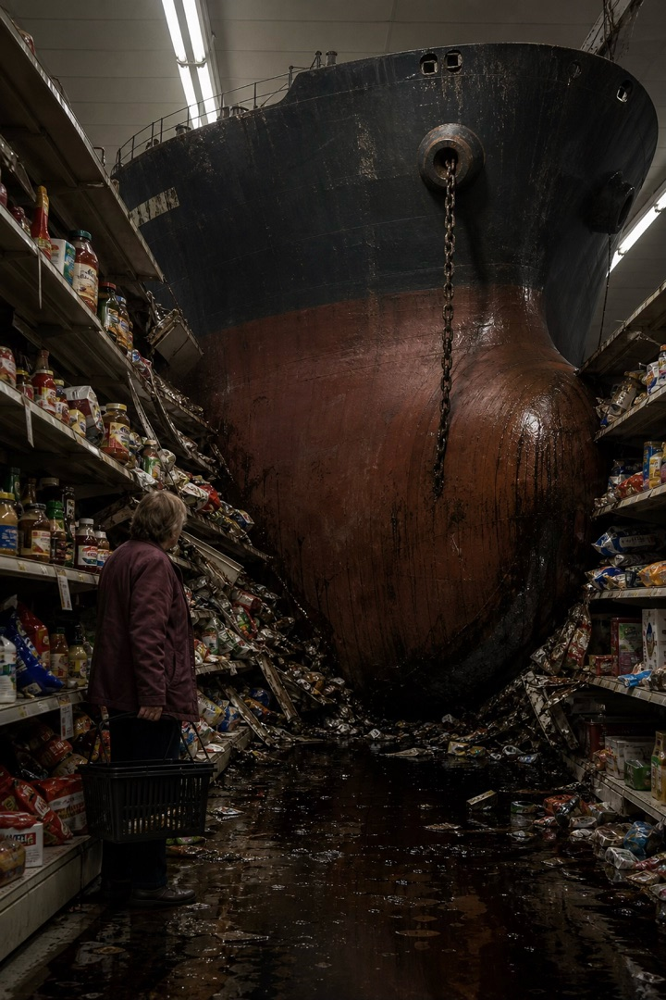 
      <strong>Figure 10.</strong> Calibration artifact 01. Test of impossible scale and collision between supply and infrastructure.
    </td>
    <td width="33.33%" valign="top">
      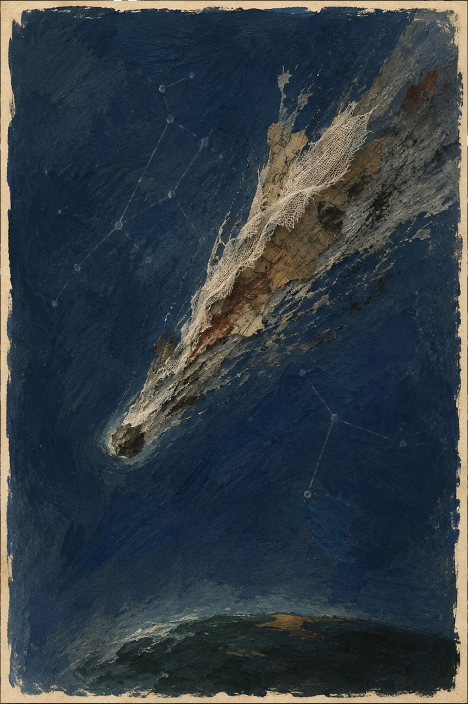 
      <strong>Figure 11.</strong> Calibration artifact 02. Test of motion and event compression through a single falling form.
    </td>
    <td width="33.33%" valign="top">
      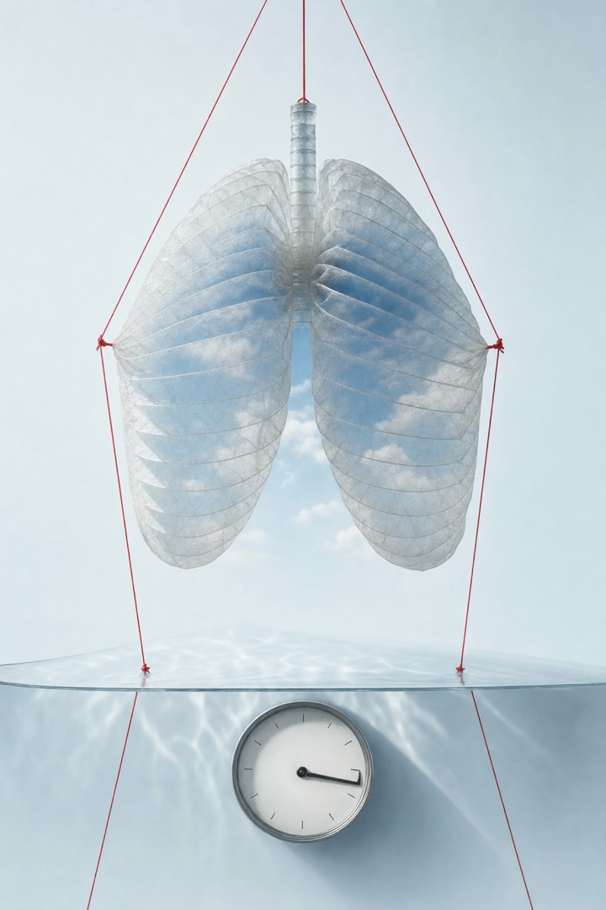 
      <strong>Figure 12.</strong> Calibration artifact 03. Test of the body as a suspended public system.
    </td>
  </tr>
  <tr>
    <td width="33.33%" valign="top">
       
      <strong>Figure 13.</strong> Calibration artifact 04. Test of institutional form reduced to one object.
    </td>
    <td width="33.33%" valign="top">
      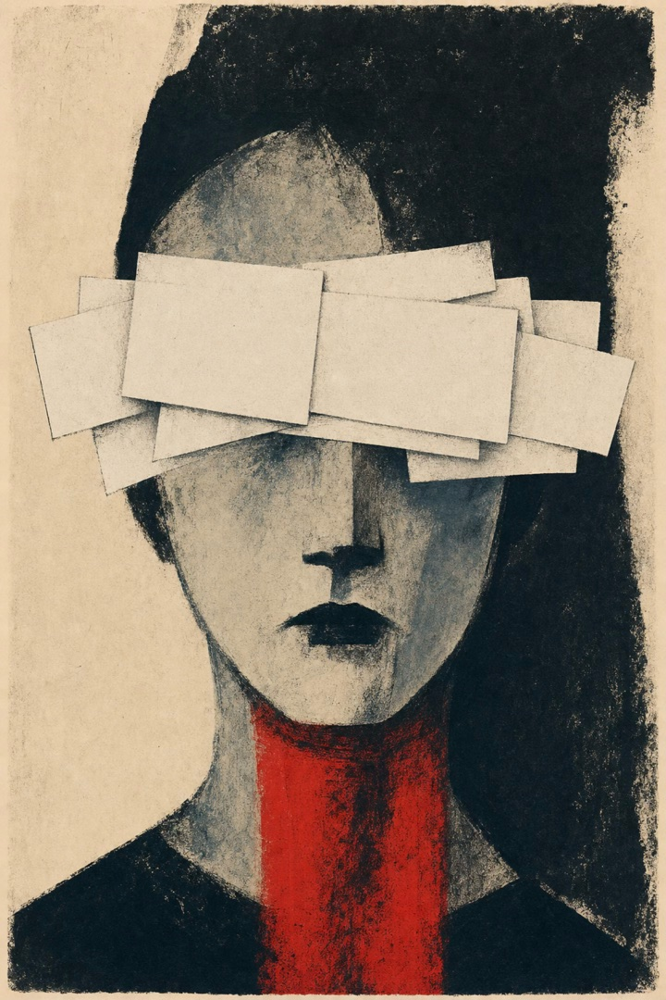 
      <strong>Figure 14.</strong> Calibration artifact 05. Test of concealment, attention and editorial symbolism.
    </td>
    <td width="33.33%" valign="top">
      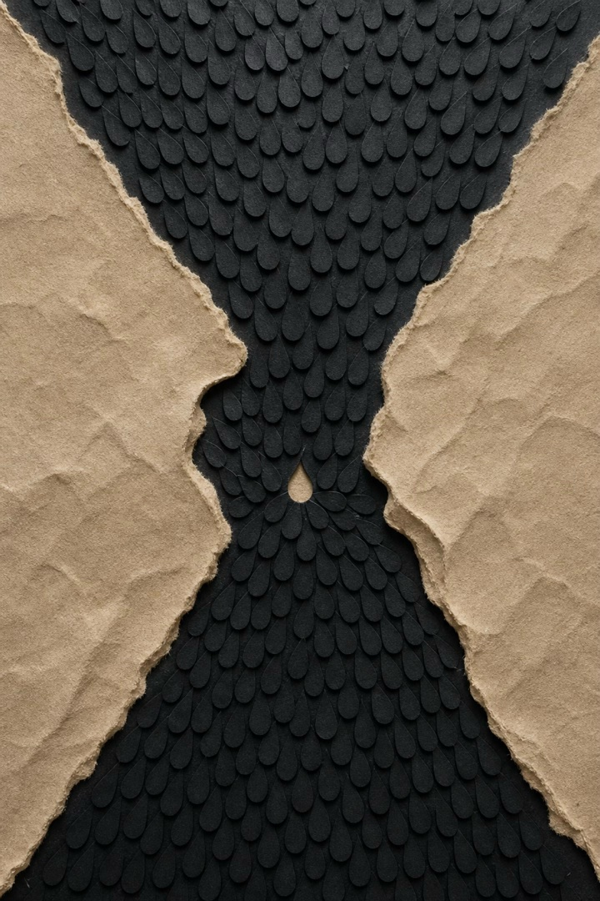 
      <strong>Figure 15.</strong> Calibration artifact 06. Test of accumulation and constriction through material abstraction.
    </td>
  </tr>
</table>

### Current modules

The table documents the working prototype while implementation remains private. Agent names describe decision roles; script names identify the runtime surfaces planned for the later code release.

| Stage | Agent or runtime surface | Responsibility | Recorded result |
|---|---|---|---|
| Evidence collection | `vigil_sensors.py` | Queries the source registry, normalizes records, records failures and reports coverage gaps | Dated evidence packet with source IDs and claim permissions |
| World interpretation | **World Reader** through `vigil_reasoning.py` | Reads the current packet independently, selects one tension and states its factual boundary or refusal | World read with counter-reading and cited signal IDs |
| Associative recall | **Hindsight Recall** through `vigil_reasoning.py` | Retrieves reviewed traces, failures and theory only after the current event has been framed | Advisory recall; no factual or procedural authority |
| Artistic reasoning | **Artistic Reasoner** through `vigil_reasoning.py` | Chooses a theoretical mode and develops five distinct positions with explicit message designs | Five concepts with subject, action, consequence and uncertainty |
| Pre-render review | **Concept Critic** through `vigil_reasoning.py` | Compares written concept descriptions before any image is generated and checks whether the proposed mechanism can survive without explanatory prose | Comparative review and a narrow clarity gate |
| Visual translation | **Creative Sight** and **Prompt Director** through `vigil_creative_engine.py` | Converts each position into a scene, composition, material action and generation instruction | Five production scenes and prompts |
| Image production | **Image gateway** | Generates all five works through GPT Image 2 under the recorded model policy | Five bound image artifacts |
| Visual review | **Visual Critic** through `visual_critic.py` | Reads finished images before seeing their intended meaning, then performs an informed comparison | Artifact reviews and machine ranking |
| Trace integrity | `trace_contract.py` and `vigil_creative_engine.py` | Binds sources, alternatives, prompts, files, hashes, critiques, structured self-reflection and human verdicts | Canonical append-only episode trace |
| Reflective memory | Artistic Reasoner, **Dream Reasoner** and Hindsight | Retains reviewed experience and relates VIGIL's reflections on itself, the world and its works across time | Candidate reflective self-model, continuity question or future experiment |
| Method learning | `trace_compiler.py`, event log and Hindsight | Detects repetition, records candidate discoveries and recalls only reviewed history | Candidate lesson, correction or human-approved method transfer |

## Why build it?

Creative work is usually judged after the result exists. The decisive moment remains hidden: why one possibility survived, why another disappeared and what could change the maker's method.

VIGIL turns that hidden interval into research material. Every public claim has a source boundary. Every cycle retains rejected positions. The visual critic first reads the image without access to the prompt. The machine's final choice is fixed before the human response. A lesson enters active memory only after it survives another context and receives human approval.

This makes the project useful for studying creativity without reducing it to a single score. The object of study is the path between evidence, association, form, judgment and revision.

## What is actually formalized

VIGIL uses two kinds of formalization. **Runtime computations** are arithmetic operations executed by Python. The **formal decision model** describes the variables available to an agent and the structure of its judgment without pretending that interpretation is a numerical optimizer. VIGIL does not calculate artistic value or derive the winning image from a weighted score.

### Runtime computations: coverage and balance

For each run, the system returns the number of registered sensors and the number the current runtime can query. Their reported ratio is:

$$
C_{run}=\frac{N_{queryable}}{N_{registered}}
$$

The 5 August 2026 snapshot gives $C_{run}=13/20=0.65$. Python produces both counts; the ratio is derived in the report. It describes technical availability and says nothing about the truth, independence or moral importance of the returned records. The following cap is executed directly. To prevent a prolific source from dominating by volume, the reasoning view retains at most eight records from any one sensor:

$$
n'_s=\min(n_s,8)
$$

### Formal decision model: World Reader

For every signal it retains, the World Reader records six bounded judgments:

$$
x_i=(e_i,\Delta_i,c_i,r_i,d_i,a_i),
\qquad 0\leq x_{i,m}\leq4
$$

They describe evidence strength, change, consequence, systemic reach, duration and an attention gap. This is a mathematical model of the agent's input and judgment surface. The agent assigns the coordinates under a validated schema; Python checks their range and provenance but does not calculate them or add them into a hidden importance score. The World Reader must still state why a signal matters now, where the claim ends and what counter-reading remains possible.

### Formal decision model: criticism and selection

After generation, the Visual Critic records a fourteen-coordinate diagnostic description for each artifact:

$$
q_j\in[0,10]^{14}
$$

The coordinates include first reading, composition, formal necessity, ambiguity, source relation, ethical attention, affect and originality. They are model judgments constrained to the interval by schema, not measurements calculated from pixels. `overall` is a separate holistic judgment, not their mean. VIGIL then compares the five actual images and commits to one through an agent judgment:

$$
\hat{j}=A\big((I_j,q_j,b_j,k_j)_{j=1}^{5}\big)
$$

Here $I_j$ is the image, $b_j$ its blind reading, $k_j$ its source-and-concept context, and $A$ denotes the recorded agent decision. The expression is a formal model of the decision path. It names the evidence available to the agent and does not claim a closed numerical solution.

### Runtime computation: learning gate

A candidate belief can be revised only when one exact artifact has a pixel-aware review, an accepted human verdict, an artifact-scoped learning proposal and a critic score at or above the current threshold of 7:

$$
P(a)=1\Longleftrightarrow R_a\land H_a\land D_a\land(s_a\geq7)
$$

$R_a$ denotes an attached pixel-aware review, $H_a$ an accepted artifact-bound human verdict and $D_a$ an artifact-scoped learning proposal.

When the gate passes, confidence is damped toward the new evidence with $\alpha=0.25$:

$$
b_{t+1}=\min\left(1,\max\left(0,(1-\alpha)b_t+\alpha e_t\right)\right),
\qquad e_t=s_a/10
$$

This formula is implemented in the runtime and the result is rounded to three decimal places. The update changes confidence in a named working hypothesis. It does not prove that an image is good, that a method generalizes or that the machine has learned creativity. A belief remains a hypothesis until it has support from three distinct trace sources; durable procedural rules remain subject to human review and transfer testing.

The current use of exactly five candidates and the pre-render clarity gate belongs to the v6 alpha study design. Five gives a comparable choice set; the clarity gate tests whether a proposed central relation survives without explanatory prose. Neither is presented as a universal theory of art.

The same gate creates a known methodological pressure. The current concept schema asks every candidate to expose a subject, an action, a consequence and a target-source metaphor. This improved message recovery after earlier images became opaque, but it also favors causal visual riddles over indexical, durational, atmospheric, serial or nonrepresentational work. The 30-evening protocol keeps the constraint stable for comparison and renders selected rejected concepts on control days. A proposed later studio mode would let VIGIL choose the work's logic while code continues to protect evidence, identity and trace integrity.

The active runtime contains no lexical or Jaccard novelty score. Repetition is retained as trace evidence and may be discussed by the agent or reported as an attractor; it cannot reject a concept through word overlap.

## A decision trace: *The Crossing Leads Back*

The source packet concerned a mass crossing into Ceuta followed by the return of most migrants to Morocco. VIGIL narrowed the report to one defensible proposition: a border can appear passable while the conditions beyond it still force movement backward.

The first image used a gate and a conveyor. It failed because the device had no recognizable purpose. Human criticism identified that failure. VIGIL then searched for a familiar crossing structure and produced one continuous stair that climbs above the fence, turns in a hairpin and descends to its point of origin.

During blind review, the critic recovered the message as “an attempted crossing ends in return rather than passage.” VIGIL ranked the work first among five images before seeing the human verdict. Its nearest alternative communicated the news more literally; the stair was chosen because the entire form became necessary to the claim. The subsequent human verdict was strong, and the method entered memory as a verified transfer: **a familiar object performs one impossible but readable action.**

The source, initial failure, image request, generated artifact, blind review, machine ranking and human verdict remain connected in one trace. See [Provenance](PROVENANCE.md).

## What informs VIGIL

VIGIL has not been fine-tuned on a private art dataset. Its artistic support is a versioned retrieval corpus: selected theory, art-historical precedents, reviewed traces and procedural rules are introduced when they can change a decision. One primary lens guides a cycle; a second may add one operation. This prevents theory from becoming decorative name-dropping.

| Corpus lens | Principal references | Effect on the Artistic Reasoner | Test used by the Critic |
|---|---|---|---|
| Visual metaphor and signs | Max Black; Charles Forceville; C. S. Peirce; Roland Barthes | Names the target, source and single property transferred between them | Both terms remain available in the pixels; a caption may anchor meaning but cannot manufacture the central relation |
| Visual forces | Rudolf Arnheim | Uses scale, direction, balance, weight and negative space as parts of the argument | First, second and third visual fixation support the intended subject, action and consequence |
| Defamiliarization and compression | Viktor Shklovsky; Bertolt Brecht; Guy Debord and Gil J. Wolman | Alters the function or scale of a familiar thing so a normalized mechanism can be seen again | One readable contradiction dominates; unrelated symbols and explanatory clutter count against the work |
| Evidence and institutions | Hans Haacke; Forensic Architecture; Taryn Simon | Exposes a material chain, institutional space, classification or omission | Every public claim stays within its source boundary; interpretation cannot pose as an indexical trace |
| Procedure, systems and constrained chance | Sol LeWitt; Yoko Ono; John Cage; Jack Burnham; Oulipo | Treats an artwork as an auditable instruction while allowing bounded variation | The procedure must produce a public proposition; chance cannot select the fact or its moral importance |
| Memory, duration and archive | On Kawara; Tehching Hsieh; Christian Boltanski; Hal Foster | Works through date, repetition, accumulation, absence and historical difference | Analogy must preserve historical differences; archival display is not used as an automatic visual solution |
| Computational creativity | Margaret Boden; Geraint Wiggins; Anna Jordanous | Treats creativity as generation within, exploration of and transformation of a possibility space | Alternatives remain visible; novelty, value, clarity and formal diversity are assessed separately |
| Reflective practice and agent memory | Donald Schön; [Hindsight](https://github.com/vectorize-io/hindsight) | Brings reviewed failures and prior decisions back into a new but already framed situation | Recall remains advisory, preserves provenance and cannot promote a method without reviewed transfer |

The Critic receives the same corpus with a different role. It checks whether the chosen operation is visible, whether composition carries the relation, whether the image exceeds the evidence and whether VIGIL is repeating a recent solution. It does not choose the political importance of the event or define artistic value with one score.

### Memory corpus

| Layer | Contents | Authority |
|---|---|---|
| Current evidence | Dated sensor records, source health, caveats and counter-readings | May support only the claims permitted by each source |
| Theory corpus | Versioned notes and source references behind the lenses above | Suggests an operation and a failure condition |
| Trace archive | Concepts, prompts, images, hashes, blind readings, machine choices and human verdicts | Preserves what happened in a particular cycle |
| Method bank | Candidate failures, discoveries, corrections and transferred procedures | Only reviewed and promoted methods may guide later runs automatically |
| Hindsight bank | Associative synthesis across reviewed traces, entities, time, theory and VIGIL's reflections on itself, the world and its works | Retain, recall and reflect over reviewed episodes; it cannot establish facts or rewrite the audit trail |

## World inputs

The registry snapshot for 5 August 2026 contains 20 open or institutionally accessible sensors; 13 are queryable in the present runtime. VIGIL keeps event occurrence, public attention and slow background conditions separate.

| Sensor | Observed signal | Epistemic use | Access snapshot |
|---|---|---|---|
| [USGS Earthquake Catalog](https://earthquake.usgs.gov/fdsnws/event/1/) | Earthquake time, place and magnitude | Direct physical event; human impact requires corroboration | Connected |
| [GDACS](https://www.gdacs.org/) | Multi-hazard alerts and modelled impact | Event and humanitarian context with model caveats | Intermittent |
| [WHO Disease Outbreak News](https://www.who.int/emergencies/disease-outbreak-news) | Dated outbreak assessments and response | Direct claims within the report's scope | Connected |
| [NASA EONET](https://eonet.gsfc.nasa.gov/docs/v3) | Curated storms, fires, volcanoes and ice events | Event location and originating-source discovery | Connected |
| [IODA](https://ioda.inetintel.cc.gatech.edu/) | Regional internet-outage alerts | Network disruption; cause remains open | Connected |
| [NOAA Space Weather](https://www.swpc.noaa.gov/) | Solar and geomagnetic alerts | Direct planetary condition | Connected |
| [CISA Known Exploited Vulnerabilities](https://www.cisa.gov/known-exploited-vulnerabilities-catalog) | Vulnerabilities observed in active exploitation | Cybersecurity and infrastructure pressure | Connected |
| [Federal Register](https://www.federalregister.gov/developers/documentation/api/v1) | US federal rules, notices and actions | Institutional change within one jurisdiction | Connected |
| [Wikimedia Pageviews](https://wikitech.wikimedia.org/wiki/Analytics/AQS/Pageviews) | Changes in article readership | Attention proxy, never proof of importance | Connected |
| [Google News RSS](https://news.google.com/rss/) | Cross-publisher headline discovery | Discovery only; claims return to the publisher | Limited |
| [GDELT](https://www.gdeltproject.org/) | News volume, themes and tone | Media-attention proxy and corroboration | Degraded |
| [NOAA Mauna Loa CO₂](https://gml.noaa.gov/ccgg/trends/) | Weekly atmospheric CO₂ | Slow planetary substrate | Connected |
| [UNHCR Refugee Data Finder](https://www.unhcr.org/refugee-statistics/) | Displacement stocks and flows | Long-duration human context with reporting lag | Connected |
| [OpenAlex](https://docs.openalex.org/) | Scholarly works and publication change | Knowledge-production and research-attention context | Limited |
| [World Bank Open Data](https://datahelpdesk.worldbank.org/knowledgebase/articles/889392) | Development and economic indicators | Slow structural baseline | Degraded |
| [NASA FIRMS](https://firms.modaps.eosdis.nasa.gov/) | Satellite active-fire observations | Physical occurrence and spread; interpretation needs context | Setup required |
| [ReliefWeb](https://apidoc.reliefweb.int/) | Humanitarian situation reports | Civilian consequence and response context | Registration required |
| [Cloudflare Radar](https://developers.cloudflare.com/radar/) | Internet outages and traffic anomalies | Regional digital disruption with coverage limits | Setup required |
| [US Energy Information Administration](https://www.eia.gov/opendata/) | Energy production, supply, prices and flows | Political-economy baseline and anomaly context | Setup required |
| [ACLED](https://acleddata.com/) | Curated political violence and protest events | Conflict evidence under ACLED methodology and terms | Setup required |

An instrumental record may support a bounded event claim. An attention signal shows where a platform audience looked. A slow indicator supplies context. The extended notes and access caveats remain available in [Sources](SOURCES.md).

## Research status

VIGIL is an operational alpha prototype. The complete cycle works: sensing, artistic reasoning, image generation, visual criticism, machine selection, human calibration and trace-bound memory. The present research phase tests whether reviewed memory improves later decisions while preserving formal variety and supporting a coherent, revisable artistic identity.

A planned 30-evening study compares runs with and without reviewed memory on matched evidence packets. The primary measure is whether independent readers can recover the intended subject, action and consequence from the image. Formal diversity, dependence on captions, selection regret and machine-human disagreement remain separate outcomes.

Two planned outcome measures are intentionally simple. Message recovery is the share of works for which an independent reader identifies the intended subject, action and consequence. Selection agreement is the share of cycles in which the machine and human choose the same work. These measures have not yet produced study results; the repository reports no effect size or claim of improvement.

## Code coming soon

This repository currently publishes the concept, architecture, selected works, source map and research framing. It does **not** contain the VIGIL runtime, model adapters, credentials, internal prompts or private research traces.

A sanitized and reproducible code release is planned after the 30-evening protocol stabilizes the interfaces and removes private paths and service-specific configuration.

## Author

**Eugene Sannikov**  
PhD researcher in AI and Art, National Academy of Fine Arts and Architecture, Kyiv  
[ORCID 0009-0008-9917-8461](https://orcid.org/0009-0008-9917-8461)

The research text and curated visual works are published under the terms in [Rights](RIGHTS.md). Citation metadata is available in [`CITATION.cff`](CITATION.cff).

## References

Reports supporting individual works, together with their claim boundaries and trace status, are listed in [Provenance](PROVENANCE.md).

### Art, theory and computational creativity

Arnheim, R. (1974). *Art and visual perception: A psychology of the creative eye* (Rev. ed.). University of California Press.

Atkin, A. (2022). Peirce's theory of signs. In E. N. Zalta (Ed.), *The Stanford encyclopedia of philosophy*. Stanford University. https://plato.stanford.edu/entries/peirce-semiotics/

Barthes, R. (1977). Rhetoric of the image. In *Image, music, text* (S. Heath, Trans., pp. 32–51). Hill and Wang.

Black, M. (1977). More about metaphor. *Dialectica, 31*(3–4), 431–458. https://doi.org/10.1111/j.1746-8361.1977.tb01296.x

Boden, M. A. (2004). *The creative mind: Myths and mechanisms* (2nd ed.). Routledge.

Brecht, B. (1964). *Brecht on theatre: The development of an aesthetic* (J. Willett, Ed. & Trans.). Hill and Wang.

Burnham, J. (1968). Systems esthetics. *Artforum, 7*(1), 30–35.

Cage, J. (1961). *Silence: Lectures and writings*. Wesleyan University Press.

Debord, G., & Wolman, G. J. (1956). Mode d'emploi du détournement. *Les Lèvres Nues, 8*.

Forceville, C. (2008). Metaphor in pictures and multimodal representations. In R. W. Gibbs Jr. (Ed.), *The Cambridge handbook of metaphor and thought* (pp. 462–482). Cambridge University Press. https://doi.org/10.1017/CBO9780511816802.028

Forensic Architecture. (n.d.). *Ground truth*. Retrieved August 5, 2026, from https://forensic-architecture.org/methodology/ground-truth

Foster, H. (2004). An archival impulse. *October, 110*, 3–22. https://doi.org/10.1162/0162287042379847

Haacke, H. (1975). *Framing and being framed: 7 works, 1970–75*. Press of the Nova Scotia College of Art and Design.

Heathfield, A., & Hsieh, T. (2009). *Out of now: The lifeworks of Tehching Hsieh*. MIT Press.

Jordanous, A. (2012). A standardised procedure for evaluating creative systems: Computational creativity evaluation based on what it is to be creative. *Cognitive Computation, 4*(3), 246–279. https://doi.org/10.1007/s12559-012-9156-1

LeWitt, S. (1967). Paragraphs on conceptual art. *Artforum, 5*(10), 79–83.

Motte, W. F. (Ed. & Trans.). (1986). *Oulipo: A primer of potential literature*. University of Nebraska Press.

Ono, Y. (1964). *Grapefruit*. Wunternaum Press.

Schön, D. A. (1983). *The reflective practitioner: How professionals think in action*. Basic Books.

Semin, D., Garb, T., & Kuspit, D. (1997). *Christian Boltanski*. Phaidon.

Shklovsky, V. (1965). Art as technique. In L. T. Lemon & M. J. Reis (Eds. & Trans.), *Russian formalist criticism: Four essays* (pp. 3–24). University of Nebraska Press. (Original work published 1917)

Simon, T. (2007). *An American index of the hidden and unfamiliar*. Steidl.

Weiss, J., & Wheeler, A. (Eds.). (2015). *On Kawara—Silence*. Guggenheim Museum Publications.

Wiggins, G. A. (2006). A preliminary framework for description, analysis and comparison of creative systems. *Knowledge-Based Systems, 19*(7), 449–458. https://doi.org/10.1016/j.knosys.2006.04.009

### Functional simulation and reflective agents

Reggia, J. A. (2013). The rise of machine consciousness: Studying consciousness with computational models. *Neural Networks, 44*, 112–131. https://doi.org/10.1016/j.neunet.2013.03.011 
*Role in VIGIL:* establishes computational simulation as a scientific method for studying functions associated with consciousness and clearly separates modelling from a claim of phenomenal consciousness.

Dehaene, S., Lau, H., & Kouider, S. (2017). What is consciousness, and could machines have it? *Science, 358*(6362), 486–492. https://doi.org/10.1126/science.aan8871 
*Role in VIGIL:* supports an operational distinction between information processing, global availability and self-monitoring that can be investigated in machine architectures.

Webb, T. W., & Graziano, M. S. A. (2015). The attention schema theory: A mechanistic account of subjective awareness. *Frontiers in Psychology, 6*, Article 500. https://doi.org/10.3389/fpsyg.2015.00500 
*Role in VIGIL:* motivates the use of an explicit, simplified model of the system's own attention as a control structure.

Graziano, M. S. A. (2017). The attention schema theory: A foundation for engineering artificial consciousness. *Frontiers in Robotics and AI, 4*, Article 60. https://doi.org/10.3389/frobt.2017.00060 
*Role in VIGIL:* directly examines how an information-processing system may model and attribute its own attentional state without invoking a non-physical essence.

Butlin, P., et al. (2023). *Consciousness in artificial intelligence: Insights from the science of consciousness*. arXiv. https://doi.org/10.48550/arXiv.2308.08708 
*Role in VIGIL:* supplies the indicator-based discipline used to discuss implemented properties while withholding a claim of phenomenal experience.

Park, J. S., O'Brien, J. C., Cai, C. J., Morris, M. R., Liang, P., & Bernstein, M. S. (2023). Generative agents: Interactive simulacra of human behavior. In *Proceedings of the 36th Annual ACM Symposium on User Interface Software and Technology* (Article 2, pp. 1–22). ACM. https://doi.org/10.1145/3586183.3606763 
*Role in VIGIL:* provides empirical support for an agent architecture in which episodic memory, reflection and retrieval affect subsequent behaviour.

### System and memory infrastructure

Sannikov, E. (2026). *VIGIL: An autonomous art machine with reflective memory* (Version 6 alpha) [Research software]. GitHub. https://github.com/esannikov/VIGIL

Vectorize. (n.d.). *Hindsight: Agent memory that learns* [Computer software]. GitHub. Retrieved August 5, 2026, from https://github.com/vectorize-io/hindsight

Latimer, C., Boschi, N., Neeser, A., Bartholomew, C., Srivastava, G., Wang, X., & Ramakrishnan, N. (2026). Hindsight: Structured agent memory that retains, recalls, and reflects. *Proceedings of the 64th Annual Meeting of the Association for Computational Linguistics, Volume 3: System Demonstrations*, 275–285. https://doi.org/10.18653/v1/2026.acl-demo.27

### Sensor and public-data sources

Armed Conflict Location & Event Data. (n.d.). *ACLED*. Retrieved August 5, 2026, from https://acleddata.com/

Cybersecurity and Infrastructure Security Agency. (n.d.). *Known Exploited Vulnerabilities Catalog*. Retrieved August 5, 2026, from https://www.cisa.gov/known-exploited-vulnerabilities-catalog

Cloudflare. (n.d.). *Cloudflare Radar API documentation*. Retrieved August 5, 2026, from https://developers.cloudflare.com/radar/

Federal Register. (n.d.). *API documentation*. Retrieved August 5, 2026, from https://www.federalregister.gov/developers/documentation/api/v1

Georgia Tech Internet Intelligence Lab. (n.d.). *Internet Outage Detection and Analysis*. Retrieved August 5, 2026, from https://ioda.inetintel.cc.gatech.edu/

Global Disaster Alert and Coordination System. (n.d.). *GDACS*. Retrieved August 5, 2026, from https://www.gdacs.org/

Google. (n.d.). *Google News*. Retrieved August 5, 2026, from https://news.google.com/

National Aeronautics and Space Administration. (n.d.-a). *Earth Observatory Natural Event Tracker API*. Retrieved August 5, 2026, from https://eonet.gsfc.nasa.gov/docs/v3

National Aeronautics and Space Administration. (n.d.-b). *Fire Information for Resource Management System*. Retrieved August 5, 2026, from https://firms.modaps.eosdis.nasa.gov/

National Oceanic and Atmospheric Administration. (n.d.-a). *Global Monitoring Laboratory: Trends in atmospheric carbon dioxide*. Retrieved August 5, 2026, from https://gml.noaa.gov/ccgg/trends/

National Oceanic and Atmospheric Administration. (n.d.-b). *Space Weather Prediction Center*. Retrieved August 5, 2026, from https://www.swpc.noaa.gov/

OpenAlex. (n.d.). *OpenAlex technical documentation*. Retrieved August 5, 2026, from https://docs.openalex.org/

ReliefWeb. (n.d.). *ReliefWeb API documentation*. Retrieved August 5, 2026, from https://apidoc.reliefweb.int/

The GDELT Project. (n.d.). *The GDELT Project*. Retrieved August 5, 2026, from https://www.gdeltproject.org/

United Nations High Commissioner for Refugees. (n.d.). *Refugee Data Finder*. Retrieved August 5, 2026, from https://www.unhcr.org/refugee-statistics/

U.S. Energy Information Administration. (n.d.). *Open data*. Retrieved August 5, 2026, from https://www.eia.gov/opendata/

U.S. Geological Survey. (n.d.). *Earthquake Catalog API*. Retrieved August 5, 2026, from https://earthquake.usgs.gov/fdsnws/event/1/

Wikimedia Foundation. (n.d.). *Wikimedia Analytics API: Pageviews*. Retrieved August 5, 2026, from https://wikitech.wikimedia.org/wiki/Analytics/AQS/Pageviews

World Bank. (n.d.). *World Bank Open Data*. Retrieved August 5, 2026, from https://data.worldbank.org/

World Health Organization. (n.d.). *Disease Outbreak News*. Retrieved August 5, 2026, from https://www.who.int/emergencies/disease-outbreak-news

### Selected-work source reports

Huamani, K., & Ortutay, B. (2026, March 25). *Jury finds Instagram and YouTube liable in a landmark social media addiction trial*. AP News. https://apnews.com/article/social-media-addiction-trial-la-5e54075023d837ccdc76c4ca512e925d

Madhani, A., & Magdy, S. (2026, August 2). *Trump says Gulf leaders' input weighed heavily in decision to hold off on ordering new Iran strikes*. AP News. https://apnews.com/article/f4c225f6667d9fd171616304701825a0

Naishadham, S. (2026, August 2). *Ceuta grapples with aftermath of border surge after most migrants leave the Spanish territory*. AP News. https://apnews.com/article/9960b15a7cf31a0592b09ac47a8eac3f

Ruíz, S. R., Naishadham, S., & Oubachir, A. (2026, August 1). *Spain installs sea barrier on Ceuta's border with Morocco after frontier rush that killed 67*. AP News. https://apnews.com/article/d76c6dc9d2da828907a1c04e1d482bbe
